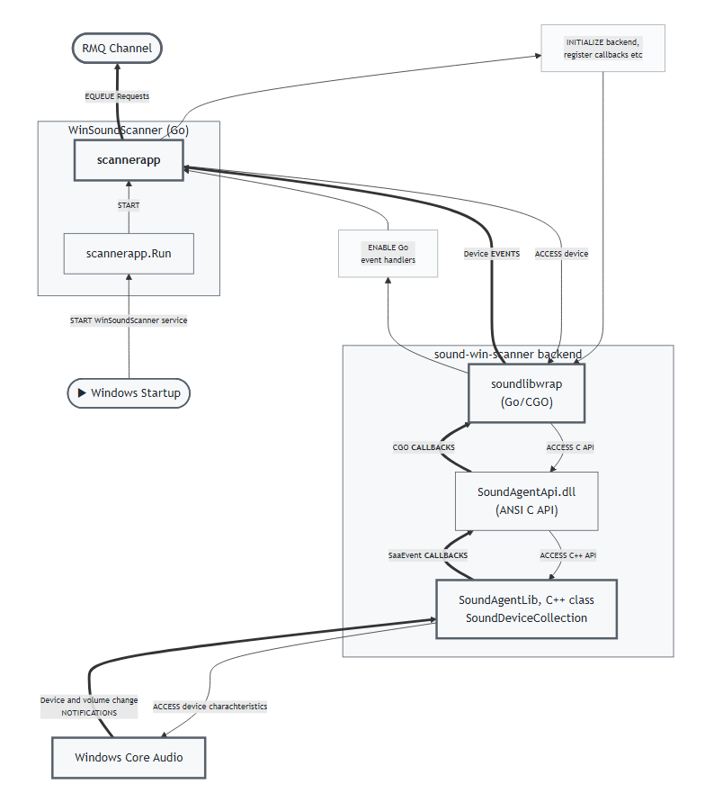

# win-sound-scanner (Windows Sound Scanner, WinSoundScanner)

WinSoundScanner detects audio endpoint devices under Windows and enqueues this information to a message queue for a target backend server.

## Architecture
<a href="./docs/module-interaction01.png">
  
</a>

## Functions
- The WinSoundScanner collects audio device information on startup and subscribes to its changes with help of a C++/Go module, see [sound-win-scanner](https://github.com/collect-sound-devices/sound-win-scanner).
- It forms the respective request-messages and pushes them to RabbitMQ channel.
- The separate RMQ To REST API Forwarder (.NET Windows Service) fetches the request-messages, transforms them to the REST API format (POST and PUT) and sends them to the 
Audio Device Repository Server (ASP.Net Core) [audio-device-repo-server](https://github.com/collect-sound-devices/audio-device-repo-server/) with a React / TypeScript frontend [list-audio-react-app](https://github.com/collect-sound-devices/list-audio-react-app/), see [Primary Web Client](https://list-audio-react-app.vercel.app) application.
<a href="./docs/202509011555ReactRepoApp.jpg">
  
</a>

## Technologies Used

- **C++/WindowsAPI/Go backend**: Core logic implementation for audio device detection and interaction with Windows APIs.
- **Go (Golang)**: Used for the main application logic and integration with C++ via CGO.
- **RabbitMQ**: Message queuing for communication between components.

Technically, WinSoundScanner is a Go(Golang)+CGO Windows executable that uses a Go module sound-win-scanner that includes a C++ Dll SoundAgentApi.dll as a backend.
It can run as a console application or as a Windows Service.

## Usage

### Steps to run
1. Download and unzip the latest rollout of WinSoundScanner-x.x.x[-rc.xx]. from the latest repository release's assets, [Release](https://github.com/collect-sound-devices/win-sound-scanner-go/releases/latest)
2. Register the service (run in elevated PowerShell):
  `.\bin\win-sound-scanner.exe install` (or unregister: `.\bin\win-sound-scanner.exe uninstall`)
3. Start the service (run in elevated PowerShell):
  `.\bin\win-sound-scanner.exe start` (or stop: `.\bin\win-sound-scanner.exe stop`). Service logs are written to:
   `%ProgramData%\WinSoundScanner\service.log`

Note: The win-sound-scanner.exe can be started as a Windows CLI, too, with logging to the console window. Stop it via Ctrl-C

## Configuration
### RabbitMQ Mode
By default, scanner uses the RabbitMQ-enqueuer to publish device information. This requires a running RabbitMQ instance.
To disable request publishing to RabbitMQ, set the environment variable `WIN_SOUND_ENQUEUER` to `empty`:
  ```powershell
  $Env:WIN_SOUND_ENQUEUER = "empty"
  ```
In order to use RabbitMQ again, set it back to empty string `rabbitmq`:
  ```powershell
  $Env:WIN_SOUND_ENQUEUER = "rabbitmq"
  ```
### Optional RabbitMQ mode overrides with default values:
```powershell
$Env:WIN_SOUND_RABBITMQ_HOST = "localhost"
$Env:WIN_SOUND_RABBITMQ_PORT = "5672"
$Env:WIN_SOUND_RABBITMQ_VHOST = "/"
$Env:WIN_SOUND_RABBITMQ_USER = "guest"
$Env:WIN_SOUND_RABBITMQ_PASSWORD = "guest"
$Env:WIN_SOUND_RABBITMQ_EXCHANGE = "sdr_exchange"
$Env:WIN_SOUND_RABBITMQ_QUEUE = "sdr_queue"
$Env:WIN_SOUND_RABBITMQ_ROUTING_KEY = "sdr_bind"
```
### Service configuration with environment variables
To store RabbitMQ settings as service environment variables, set them before `install`:
```powershell
$Env:WIN_SOUND_ENQUEUER = "rabbitmq"
$Env:WIN_SOUND_RABBITMQ_HOST = "localhost"
$Env:WIN_SOUND_RABBITMQ_PORT = "5672"

.\bin\win-sound-scanner.exe install
```
Only currently defined `WIN_SOUND_*` variables are written into the service config.
If you change service env vars later, run `stop`, `uninstall`, `install`, `start`.

## Build and Debug

### Prerequisites:
Enable CGO  and a GCC-style toolchain (MinGW-w64 gcc or LLVM-mingw clang).
- Download an x86_64 LLVM‑mingw build (zip) from the official releases (search for “llvm-mingw releases”).
- Your download's name is similar to llvm-mingw-20251118-msvcrt-x86_64.zip
- Copy its bin, include,lib and x86_64-w64-mingw32 folders to some folder, e.g., E:\tools\llvm-mingw

### Build Steps

- Run `.\scripts\build.ps1 -m "E:\tools\llvm-mingw"` with your path to the mingw toolchain
- Alternatively, set the environment variables for CGO and the compiler manually, then run the build commands below:
  ```powershell
  $Env:CGO_ENABLED = "1"
  $Env:CC = "E:\tools\llvm-mingw\bin\x86_64-w64-mingw32-clang.exe"
  $Env:CXX = "E:\tools\llvm-mingw\bin\x86_64-w64-mingw32-clang++.exe"

  go build -o (Join-Path $PWD.Path 'bin/win-sound-scanner.exe') ./cmd/win-sound-scanner

  .\scripts\fetch-native.ps1

  ## once more
  go build -o (Join-Path $PWD.Path 'bin/win-sound-scanner.exe') ./cmd/win-sound-scanner
  ```

### Debug
Compile with -gcflags=all="-N -l" to disable optimizations and inlining, then run with a debugger
  ```powershell
  go build -gcflags "all=-N -l" -o (Join-Path $PWD.Path 'bin/win-sound-scanner.exe') ./cmd/win-sound-scanner
  dlv --listen=:2345 --headless=true --api-version=2 --accept-multiclient exec ./bin/win-sound-scanner.exe
  ```
Then use remote debugging in your IDE (e.g., GoLand) to connect to localhost:2345


## License

This project is licensed under the terms of the [MIT License](LICENSE).

## Contact

Eduard Danziger

Email: [edanziger@gmx.de](mailto:edanziger@gmx.de)
